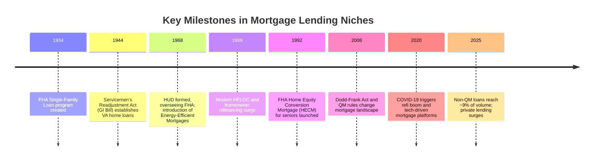

# Executive Summary

We identified the top 10 mortgage loan–officer niches by examining industry sources, market data, and common job specializations.  Demand in these niches is driven by borrower demographics and loan-product segments. For example, FHA insured over 766,900 mortgages in FY2024, serving largely first-time and lower-income buyers, while VA loans accounted for roughly 8% of U.S. mortgage originations in 2024.  First-time homebuyers (21% of buyers in 2024) and real-estate investors (surging private lending, +14% YOY) stand out for volume and growth.  By contrast, non-QM (“alternative”) loans just reached ~9% of lock volume by late 2025, but are expanding rapidly.  Based on market size, growth, profitability, and entry barriers, our ranked top-10 niches are:

1. **First-Time Homebuyer Specialist** – Large volume (≈1M loans/year) despite a recent low share; steady demand driven by millennials.  
2. **Real Estate Investor Specialist (DSCR/Rental/Flip)** – Fastest-growing segment (institutional investors and private lenders stepping in); higher fees on large or portfolio loans.  
3. **Veterans (VA Loan) Specialist** – VA loans remain a stable ~8–10% market niche with strong demand among veterans.  
4. **Self-Employed/Non-QM Specialist** – Non-traditional income borrowers (bank-statement and stated-income) form a growing share (~9% locks) as conventional underwriting tightens.  
5. **Jumbo/Luxury Specialist** – High-net-worth borrowers on big homes; 2024 jumbo purchases were ≈21% of mortgage dollars, with large individual loan amounts.  
6. **Credit-Challenged/Alt-Doc Specialist** – Borrowers with low credit or complex histories; part of the non-QM market (rapidly expanding) but higher risk and strict compliance.  
7. **Government-Backed Loans Specialist (FHA/USDA)** – Specializes in FHA (first-time, down payment aid) and USDA (rural/low-income) programs; sizeable volume (FHA’s forward mortgages ~767K in 2024).  
8. **Renovation/Construction Specialist** – Loans for home remodeling or new construction; tied to the ~$574B U.S. home improvement market.  
9. **Reverse Mortgage Specialist** – Loans for seniors (HECMs); FHA insured ~26,500 HECMs in FY2024.  
10. **Foreign National Borrower Specialist** – Lending to non-U.S. citizens (often high down-payments, portfolio loans); niche but growing in globalized markets.  

Each niche is detailed below with its definition, client profile, products, key skills, marketing channels, compliance issues, revenue model, market indicators (with citations), and suggested learning objectives and lesson topics. A comparison table follows.  

## Rank 1: First-Time Homebuyer Specialist

*Definition:* Serves first-time homebuyers through low-down-payment and incentive programs. This niche focuses on educating new buyers about the homebuying process, down-payment assistance, and affordable financing.

- **Typical Customers:** Young families and individuals (often under 35) entering the housing market for the first time. Many have limited homeownership experience or savings (median down payment ~9% for first-timers).
- **Loan Products/Services:** Primarily purchase loans (conventional with down-payment assistance, FHA-insured 3.5% down loans, state/local first-time buyer programs, homebuyer education counseling). Also handles pre-approvals, credit counseling, and grant programs.
- **Key Skills/Competencies:** Patient communication and education skills, knowledge of loan programs (FHA, conventional grants), financial counseling, partnership with housing agencies and realtors. Ability to simplify complex terms.
- **Marketing Channels & Leads:** Partner with first-time buyer–focused Realtors, credit counselors, community programs, and social media (e.g. “first home” content). Lead sources include housing fairs, community nonprofits, online ads targeting young buyers, and referrals from accountants/financial planners.
- **Regulatory/Compliance:** Stay current on CFPB rules and RESPA disclosures for purchase loans, plus state-specific first-time-buyer grant regulations. FHA loans require strict adherence to FHA mortgage-insurance rules (MIP) and inspection requirements.
- **Revenue Model/Fee Structure:** Commission based on loan amount (often lower per-loan because of smaller home values, but volume can be high). May earn bonuses from lenders for volume. Fees can include lender credit for down-payment assistance programs.
- **Market Size/Demand:** NAR reports first-time buyers were ~21% of home buyers in 2024. FHA insured 766,942 mortgages in FY2024, of which 82.6% (~498K) were first-time buyer purchases. Despite a “historic low” share, absolute first-time purchases remain near one million annually. Demand is sustained by millennials reaching home-buying age; affordability issues are the main barrier.
- **Learning Objectives:** Loan officers should learn: First-time buyer needs and psychology; available down-payment assistance and state/local programs; structuring low-down-payment loans; credit counseling basics; and working with housing agencies.
- **Lesson Topics (6–10):** 
  1. **Homebuying 101:** Timeline from pre-approval to closing; budgeting for down payment and closing costs.  
  2. **FHA and Low-Down-Payment Loans:** FHA requirements, mortgage insurance, gift funds, Fannie/Freddie first-time programs.  
  3. **Down-Payment Assistance & Grants:** Federal/state/local assistance programs, IRS gift rules, lender credit strategies.  
  4. **Credit Education:** Guiding buyers to improve credit scores, debt-to-income limits for low-down loans.  
  5. **Working with Realtors and Counselors:** Building referral networks in first-time buyer communities; hosting seminars.  
  6. **Compliance for Purchase Loans:** RESPA/TILA rules, evaluation of borrower assets, fair lending considerations.  

## Rank 2: Real Estate Investor Specialist (DSCR/Rental/Flip)

*Definition:* Serves real-estate investors purchasing rental properties, fix-and-flips, or small multifamily units. Emphasizes financing that relies on property cash flow (Debt-Service Coverage Ratio, DSCR) or property value rather than personal income.

- **Typical Customers:** Individual landlords and entrepreneurs building rental portfolios or flipping homes. Often have multiple properties and nonstandard income sources. May include “accidental landlords” and small developers.
- **Loan Products/Services:** DSCR loans (based on rental income), portfolio loans, fix-and-flip bridge loans, multi-family loans (including Ginnie-backed for 5+ units). May also offer commercial loans or SBA loans for property-based businesses.
- **Key Skills/Competencies:** Expertise in rental underwriting, DSCR calculations, investment property appraisal, knowledge of local rental market. Ability to structure creative deals (interest-only, cross-collateralization). Strong network with realtors and builders.
- **Marketing Channels & Leads:** Networking with real-estate investment groups, property managers, and realty agents who specialize in income properties. Content marketing on topics like “buy-and-hold investing.” Leads via bankruptcy attorneys or estate planners (for inherited properties).
- **Regulatory/Compliance:** Must understand CFPB and state laws on investment property loans (often exempt from QM rules), and FRA/RESPA rules on rental properties. For Ginnie loans (FHA/VA on multifamily), HUD guidelines apply. Private lenders may require strict appraisal and environmental checks.
- **Revenue Model/Fee Structure:** Higher loan amounts ($200K–$1M+), so commissions can be large. Many loans are non-QM with higher rates and broker fees. Some earn yield spread premiums or portfolio-lender incentives for volume. Flip loans often have points/interest structures, rehab escrow fees.
- **Market Size/Demand:** Private investment lending is booming – 2025 non-QM securitizations hit record highs and private lending volume grew ~14% year-over-year. DSCR and bank-statement loans drove much of the growth. Demand is fueled by constrained conventional underwriting and a hot rental market. Anecdotally, DSCR lending is now a “go-to” strategy for investors.
- **Learning Objectives:** Officers should learn: underwriting rentals (DSCR formulas, permitted expenses); fix-and-flip timeline and compliance; multifamily underwriting (rents vs personal income); building investor referral networks; tax and entity considerations for investors.
- **Lesson Topics (6–10):** 
  1. **DSCR Loans Explained:** How rental income qualifies borrowers; typical DSCR ratios; loan terms.  
  2. **Fix-and-Flip and Bridge Financing:** Short-term construction loans; rehab budgets; ARV (after-repair value) calculation; exit strategies.  
  3. **Portfolio Lending & Multi-Unit Properties:** Financing 4+ unit buildings; FHA 223(f) and VA for multi-family; landlord-occupied vs purely investment.  
  4. **Property Analysis:** Rental market analysis, tenant occupancy rules, NOI (net operating income) vs. cash-flow.  
  5. **Investor Relationship Building:** Working with property managers, real-estate syndicators, and attorneys; referrals.  
  6. **Regulatory Considerations:** Federal and state usury laws, borrower disclosures for investment properties; anti-flipping timelines (for FHA/VA).  

## Rank 3: Veterans (VA Loan) Specialist

*Definition:* Focuses exclusively on VA-guaranteed home loans for veterans, active-duty service members, and eligible spouses. Involves deep knowledge of VA eligibility and benefits.

- **Typical Customers:** Military service members (active, reserve) and veterans of any age, often buying primary residences (some second homes at smaller rates). May include surviving spouses.
- **Loan Products/Services:** VA Purchase Loans (0% down, no MI) and VA IRRRL (interest rate reduction refi). Also can advise on Certificate of Eligibility (COE) issues, VA appraisal waivers (Funding Fee purposes).
- **Key Skills/Competencies:** Mastery of VA rules (entitlement, occupancy, residual income requirements). High empathy and trust-building, understanding military culture and frequent relocations (PCS). Ability to process VA-specific paperwork (e.g. COE, DD214).
- **Marketing Channels & Leads:** Partner with military-affiliated realtors, base housing offices, veteran service organizations (e.g. DAV, VFW), veteran-run businesses. Online targeting on veteran forums, military base events. Leads often come from referral networks within the military community.
- **Regulatory/Compliance:** VA loans have unique guidelines (VA Lender Handbook rules). Stay on top of VA Funding Fee updates, appraisal/geographic limits, and Texas VA 50(a) compliance (state laws on liens for improvements). NMLS state licensing applies as usual.
- **Revenue Model/Fee Structure:** Commission on large purchase amounts (median VA loan ~$360K). VA loans often allow seller credit of up to 4% and limited closing costs (borrower limited), so loan officers rely on commission percent rather than borrower fees. Some lenders pay bonuses for high VA volume.
- **Market Size/Demand:** According to VA data, VA loans average 8–12% market share historically, dipping to ~8% in 2024 due to high rates. More than 300,000 VA home loans are typically guaranteed annually nationwide. Underutilization studies estimate ~58,000 potential VA loans go unused each year, indicating room to grow.
- **Learning Objectives:** Loan officers should learn: VA loan eligibility and entitlement; VA underwriting rules (residual income, credit allowances); obtaining and correcting COEs; and networking within the military community. 
- **Lesson Topics (6–10):** 
  1. **VA Benefits & Eligibility:** VA loan entitlements, bonus and disability implications.  
  2. **VA Underwriting Rules:** Residual income calculations, required occupancy, credit overlays.  
  3. **VA Loan Products:** IRRRL refi process; hybrid ARMs, and specialty VA programs (Energy Efficient Mortgages).  
  4. **Certification and COE Processing:** Navigating VA portal, correcting birthdates/DD214 errors, etc.  
  5. **Military Community Outreach:** Building trust with military borrowers; marketing at bases.  
  6. **VA Compliance:** DD-214 verification, Home of Record rules, MLO licensing requirements for VA lenders.  

## Rank 4: Self-Employed / Non-QM Specialist

*Definition:* Serves self-employed borrowers and small-business owners whose income is hard to document conventionally. Focuses on alternative documentation loans (bank-statement loans, 1099/asset loans).

- **Typical Customers:** Business owners, freelancers, consultants, or commissioned salespeople. Often have high incomes on paper but can’t document via standard paystubs/tax returns (e.g. due to write-offs). May include doctors, lawyers, realtors, or gig economy workers.
- **Loan Products/Services:** Non-QM loans like bank-statement programs (12-24 months of bank deposits), asset depletion loans, DSCR (for self-employed investors), and hybrid Doc Stated Income. Also Fannie/Freddie bank-statement products where available. May involve frequent use of LPAs (Desktop Underwriter) with manual adjustments.
- **Key Skills/Competencies:** Ability to analyze business cash flow from bank statements, read business tax returns, and calculate discretionary income. Sales skills to educate borrowers on why standard loans might fail and how alt-doc works. Strong understanding of varied documentation packages.
- **Marketing Channels & Leads:** Networking with CPAs, tax advisors, and SCORE/business groups. Online marketing (articles on “bank statement mortgages” for entrepreneurs). Referrals from realtors who deal with many small-business buyers. Targeted PPC ads for “self-employed home loans.”
- **Regulatory/Compliance:** Be mindful that non-QM loans are exempt from qualified mortgage (QM) rules under ATR (Ability to Repay) but still subject to general anti-fraud and fair lending standards. Must ensure veracity of bank statements (fraud risk). State-specific non-QM licensing if applicable (NMLS). 
- **Revenue Model/Fee Structure:** Non-QM loans often have higher interest rates and upfront fees (origination points). Brokers may charge broker fees (e.g. 1–2% of loan). Many private lenders pay yield-spread premiums. Because these borrowers often take larger loans (after business success), revenue per loan can be substantial.
- **Market Size/Demand:** Non-QM lending has grown rapidly. By late 2025, Non-QM accounted for ~9% of lock volume (up from ~5% a year prior). Self-employed borrowers drove much of this growth. According to industry data, non-QM share is expected to reach 10–15% of originations by 2026, indicating strong demand.
- **Learning Objectives:** Loan officers should learn: verifying self-employed income via bank statements/tax returns; structuring non-QM loans (max DTI, DSCR options); underwriting guidelines for various documents; and marketing to entrepreneur communities.
- **Lesson Topics (6–10):** 
  1. **Non-QM Program Overview:** Bank-statement loan mechanics; 1099/combo loans; credit considerations.  
  2. **Analyzing Financial Documents:** Reading profit & loss statements, personal vs. business accounts, tax write-off impacts.  
  3. **DSCR and Asset Loans:** Using asset depletion or DSCR for self-employed with large assets but irregular income.  
  4. **Credit Overlays and Pricing:** How credit score, LTV, and loan term affect rate/fee.  
  5. **Fraud Prevention:** Identifying altered documents; KYC (know-your-customer) best practices.  
  6. **Marketing to Entrepreneurs:** Building relationships with business owners, CPA referrals, creating content (blogs/webinars) targeted to self-employed buyers.  

## Rank 5: Jumbo / High-Net-Worth Specialist

*Definition:* Focuses on high-balance loans above conforming limits, serving affluent clients purchasing luxury homes or second/vacation properties. Requires expertise in complex financial profiles.

- **Typical Customers:** High-income individuals or households (often executives, investors, retirees) buying luxury primary homes or second properties. They may have significant liquid assets but may be cash-flow constrained. Also includes financed buyers in high-cost markets.
- **Loan Products/Services:** Jumbo purchase and refi loans (portfolio or agency), interest-only options, low cash-out limits. Specialized programs for ultra-high-net-worth (e.g. no PMI, asset-transfer). Second-home financing, cash-out for investment.
- **Key Skills/Competencies:** Detailed underwriting of complex assets (stocks, bonds, business equity) and income (large bonuses, carried interest). Knowledge of tax strategies for luxury homeownership. Discretion and client-service skills.
- **Marketing Channels & Leads:** Realtor teams specializing in luxury market, private bankers, wealth management referrals, networking in affluent communities (country clubs, philanthropic groups). High-end digital marketing (LinkedIn, luxury home sites). Referrals from CPAs and attorneys handling estates.
- **Regulatory/Compliance:** Jumbo loans follow investor guidelines (e.g. Fannie Mae No MI, limited DTI). Must comply with SEC rules if offering asset-based underwriting. State-specific high-value home laws (e.g. California’s 1% property tax cap considerations). Fair lending vigilance (charging higher rates must be justified).
- **Revenue Model/Fee Structure:** Big dollar amounts yield higher commissions (e.g. $1M loan at 1% = $10K). Often allow higher broker fees or “points” structures. Some lenders waive discount points as incentive. Refinance business can be lucrative when these borrowers downsize or refinance.
- **Market Size/Demand:** Jumbo originations contracted in 2023–24 after pandemic highs. CoreLogic reports 2024 jumbo originations were down 56% from 2022 and at 10-year lows. However, jumbo home purchases still made up ~21% of buy mortgages by mid-2024, reflecting continued demand in expensive markets. As rates fall, refinancing large loan balances could surge.
- **Learning Objectives:** Officers should learn: underwriting high-LTV and no-PMI loans, analyzing liquidity ratios, jumbo lending guidelines (agency vs. portfolio), and marketing to UHNW clients.
- **Lesson Topics (6–10):** 
  1. **Jumbo Loan Guidelines:** Differences from conforming (higher FICO, cash reserves); Fannie/Freddie’s high-balance program rules.  
  2. **High-Net-Worth Underwriting:** Considering alternative assets (marketable securities, business interests) in lieu of income.  
  3. **Luxury Market Trends:** Current luxury home market overview; buying behaviors in Tier-1 cities.  
  4. **Larger Loan Structuring:** Interest-only vs. fixed, piggyback loans vs. no PMI, portfolio lender options.  
  5. **Compliance:** Tax disclosure for foreign income/assets if relevant; ensuring accurate appraisals for high-end properties.  

## Rank 6: Credit-Challenged / Nontraditional Borrower Specialist

*Definition:* Works with borrowers who have impaired or limited credit histories. Provides “rehab” loans (fixer-upper with poor credit) or loans with flexible underwriting (compensating factors).

- **Typical Customers:** Applicants with recent credit events (bankruptcy, foreclosure, short sale) or lacking credit history (thin file). Also clients with high debt or unemployment gaps. Often middle-income buyers denied by conventional channels.
- **Loan Products/Services:** Non-QM credit rehab programs (accepting lower FICO and higher DTIs), FHA/VA with credit overlays, and specialty products like “rapid rescore” services. May also use down-payment funds from grants to offset risk.
- **Key Skills/Competencies:** Deep understanding of credit scoring, manual underwriting, and FHA 2-year post-bankruptcy waiting periods, etc. Counseling on rebuilding credit. Negotiating payoffs with creditors.
- **Marketing Channels & Leads:** Partnerships with credit counseling agencies, bankruptcy attorneys, mortgage relief forums, and reverse escrow companies. Online ads targeting “poor credit home loan” searches. Certifications in credit repair can boost credibility.
- **Regulatory/Compliance:** Must comply with MBA’s Misrepresentation policies (no inflating incomes) and CFPB’s higher-priced mortgage loan rules if applicable. FHA loans require consumer credit counseling for recently bankrupts. Strict appraisal and verification of efforts to improve credit.
- **Revenue Model/Fee Structure:** Often higher-priced (higher interest rates, points) to mitigate risk. Some lenders charge set fees for rehab counseling. Commissions can be average due to smaller loan sizes, but volume may compensate.
- **Market Size/Demand:** Non-QM market includes these borrowers. As FHA share has risen to ~14–20% historically, many underserved borrowers go FHA. According to FHA, >82% of their purchase business in 2024 were first-time or minority buyers (who often have credit issues). The market is cyclical: credit cures and economic recovery will affect demand, but a backlog of younger/ first-time buyers suggests ongoing need for credit-flexible loans.
- **Learning Objectives:** Loan officers should learn: advanced credit analysis (FICO breaks, manual underwriting), FHA “credit event” rules, and structuring loans with compensating factors (higher reserves). 
- **Lesson Topics (6–10):** 
  1. **Credit Scoring Basics:** FICO components, impact of past events, credit repair fundamentals.  
  2. **Manual Underwriting:** Using AUS vs. manually justifying loans; compensating factors for high DTI or low scores.  
  3. **FHA/VA Credit Exceptions:** Guidelines for bankruptcy, foreclosure, and short sales (waiting periods, required documentation).  
  4. **Non-QM Credit Programs:** Portfolio lender alternatives, low-documentation rehab loans.  
  5. **Rehabilitation Counseling:** How to advise borrowers to improve scores and qualify (e.g. paying off collections).  

## Rank 7: Government-Insured Loans Specialist (FHA/USDA)

*Definition:* Specializes in U.S. government-backed home loan programs (FHA and USDA) targeting low-to-moderate income or rural borrowers, often with down-payment constraints.

- **Typical Customers:** Moderate-income families, first-time homebuyers, rural or suburban homebuyers. Often minority or immigrant households (FHA serves a high share of these groups).
- **Loan Products/Services:** FHA 203(b) purchases and refinances (FHA-Insured loans with 3.5% down), FHA 203(k) renovation loans, USDA Rural Housing loans (home loans with low down-payment for eligible rural areas), and related grant/skip payment programs.
- **Key Skills/Competencies:** In-depth FHA/USDA program knowledge (property eligibility, MI/guarantee fee, appraisal/inspection standards). Ability to navigate additional paperwork (e.g. HUD up-front or subsidy layers).
- **Marketing Channels & Leads:** Collaborate with HUD-approved housing counselors, rural community groups, and regional employers. Partner with affordable-housing developers and Habitat for Humanity affiliates. Online ads focused on “low down payment” and “rural home loans.”
- **Regulatory/Compliance:** Strict adherence to FHA/USDA underwriting guides. For FHA: Mortgage Insurance Premium accounting, use of FHA-designated appraisers, flood insurance in special flood hazard areas. USDA has geographic and income limits and uses case numbers from USDA. Both programs require precise income calculations (especially USDA).
- **Revenue Model/Fee Structure:** FHA/USDA loans allow seller concessions and limited borrower costs, so loan officers rely on volume to earn commissions. Some lenders offer “allowed costs” reimbursements (e.g. credit for paying MI). No private mortgage insurance on USDA or FHA (just guarantee fee), so standard broker commission percentages apply.
- **Market Size/Demand:** FHA and USDA provided mortgages for hundreds of thousands annually. In FY2024, FHA insured 766,942 forward mortgages. USDA loans are smaller in number (about 50–70K per year) but critical in certain regions. FHA’s share of mortgages was ~13–17% recently. FHA is especially prominent in first-time and minority markets.
- **Learning Objectives:** Loan officers should learn: FHA and USDA borrower eligibility criteria; appraisal and property standards; nuances of government underwriting (income limits, seller concession rules); and how to tap into housing subsidy programs (down-payment grants).
- **Lesson Topics (6–10):** 
  1. **FHA Program Basics:** Credit score requirements, MIP (mortgage insurance premiums), appraisal standards.  
  2. **USDA Rural Housing Loans:** Eligibility maps, income caps, guarantee fees, and “check prints”.  
  3. **203(k) Renovation Loans:** Process for including repair costs, escrow management.  
  4. **Affordable Housing Overlays:** Working with down-payment assistance grants, Good Neighbor Next Door program, HFA ties.  
  5. **Regulatory Compliance:** FHA LDP (Loan Disqualification) and AUP processes; USDA documentation and compliance.  

## Rank 8: Renovation/Construction Loan Specialist

*Definition:* Focuses on financing home improvements and new construction. This includes renovation loans (combining purchase with remodeling) and construction loans for ground-up builds or major rehab.

- **Typical Customers:** Buyers purchasing fixer-uppers, homeowners doing major remodels, and custom home builders. Often first-time or move-up buyers who need to renovate to meet their needs. 
- **Loan Products/Services:** FHA 203(k) and Fannie HomeStyle renovation loans, single-close purchase+renovation mortgages, private construction loans (builder loans, lot loans), and home equity lines of credit (HELOCs) for improvements.
- **Key Skills/Competencies:** Understanding of construction lending (draw schedules, liens, inspection draws), appraisal after-improved value, contractor bid review. Ability to explain escrow holdback processes to borrowers. Project management sense is a plus.
- **Marketing Channels & Leads:** Realtors who specialize in fixer-uppers, contractors and builders, home improvement stores. Content marketing on “fixer-upper financing.” Partnerships with remodeling professionals and architects. Leads from builders/developers.
- **Regulatory/Compliance:** Ensuring proper escrow holds and construction disbursement compliance. FHA 203(k) loans require HUD consultants and verification of work, so overseeing HUD-required inspection is key. State contractor licensing laws may affect loans.
- **Revenue Model/Fee Structure:** Often larger loans (purchase+repair) yield sizable commissions. Construction loans may have upfront fees, and interim interest payments accrue. Brokers can charge points on construction loans. Custom home mortgages may have tiered pricing.
- **Market Size/Demand:** U.S. home improvement spending was $574.3 billion in 2024 (professional + DIY), illustrating strong renovation demand. Data shows modest growth in home spending (3–4% annually). FHA’s 203(k) accounts for a fraction of that, but with rising home prices and supply shortages, many buyers need renovation financing. Demand tends to correlate with existing-home sales; expected moderate growth in coming years.
- **Learning Objectives:** Officers should learn: Construction loan types (single-close vs. two-close); managing draw schedules; underwriting after-improved appraisal values; working with contractors. 
- **Lesson Topics (6–10):** 
  1. **FHA 203(k) Loans:** Eligibility, consultant reports, required repairs vs. cosmetic updates.  
  2. **HomeStyle and Other Renovation Programs:** Conventional alternatives, minimum investment requirements.  
  3. **Construction Loan Mechanics:** Difference between construction-to-permanent vs. standalone construction loans, borrower qualification (often shoulder stress test rates).  
  4. **Appraisal After Completion:** Working with appraisers on “as-completed” values and hard bids.  
  5. **Contractor and Build Oversight:** Verifying contractor licensing, lien waivers, and inspection draws.  

## Rank 9: Reverse Mortgage Specialist

*Definition:* Specializes in Home Equity Conversion Mortgages (HECM) and proprietary reverse mortgages for seniors (typically age 62+), allowing conversion of home equity into cash flow.

- **Typical Customers:** Older homeowners (62+) who wish to supplement retirement income, pay medical bills, or age in place. Often have substantial home equity but fixed incomes.
- **Loan Products/Services:** FHA-insured HECMs (fixed or adjustable rate), plus proprietary jumbo reverse mortgages. Counseling referrals are mandatory. May also coordinate HECM for purchase (H4P) loans.
- **Key Skills/Competencies:** Understanding of unique underwriting (residual income, longevity of funds), reverse calculation (principal limit factor, MIP). Empathy and communication skills to explain complex terms (surrender vs. deferred loan balance). Familiarity with retiree financial issues.
- **Marketing Channels & Leads:** Partnerships with senior centers, elder law attorneys, financial planners, home health agencies. Community outreach (seminars for seniors). Networking through AARP or similar organizations. Advertising in publications for seniors.
- **Regulatory/Compliance:** Must comply with HUD/FHA HECM rules and mandatory counseling. CFPB’s nontraditional mortgage guidelines (reverse mortgages are a “nontraditional mortgage” with their own section). Strict anti-equity-stripping scrutiny (State-level laws). Ensure borrowers understand loan terms (closure on sale, inheritance impact).
- **Revenue Model/Fee Structure:** Lender-paid comp often higher than purchase loans (due to upfront and ongoing insurance premiums). Commission typically 2% or more of initial principal limit, plus retention on servicing if closed. Refinances (HECM for Purchase) can be lucrative.
- **Market Size/Demand:** FHA reports 26,501 forward HECMs in FY2024, down slightly from pandemic highs. HECMs serve about 173,000 seniors/year with in-force loans. Demand depends on interest rates and HUD policy (MIP changes). The retiree population is growing, but skepticism about reverses remains an obstacle.
- **Learning Objectives:** Loan officers should learn: HECM qualification (financial assessment, non-borrowing spouse rules); calculation of principal limits; counseling process requirements; alternatives (home equity line of credit vs reverse).  
- **Lesson Topics (6–10):** 
  1. **HECM Fundamentals:** How reverse mortgages work, use of proceeds (lump sum, line of credit).  
  2. **Eligibility and Financial Assessment:** Mandatory counseling, “financial assessment” for FHA solvency.  
  3. **Repayment Triggers:** Obligations for residence and property taxes, disbursement options (tenure, term, line of credit).  
  4. **Risks and Compliance:** Ensuring seniors understand interest accrual, HUD guidelines, and ability to sustain property charges (tax/insurance).  
  5. **Reverse for Purchase:** How a HECM can enable a senior to buy a new home; criteria and benefits.  

## Rank 10: Foreign National Borrower Specialist

*Definition:* Serves non-U.S. citizen borrowers (foreign nationals or resident aliens) who wish to buy U.S. property. This niche requires knowledge of cross-border financing and tax/immigration considerations.

- **Typical Customers:** Foreign investors buying U.S. real estate, expatriates, or immigrants without full credit history. They often make large down payments (20–50%) and have strong financial documentation abroad. Clients might include foreign executives, diplomats, or entrepreneurs.
- **Loan Products/Services:** Portfolio mortgages for non-residents (higher credit req., often 30–40% down). Programs for Green Card holders with ITIN. May involve foreign credit reports and requiring U.S. bank accounts or ties. Sometimes work with private banking networks.
- **Key Skills/Competencies:** Familiarity with Foreign Investment in Real Property Tax Act (FIRPTA) rules, IRS withholding. Ability to verify foreign assets/income (private bank statements, translations). Navigating E-2 visa and EB-5 immigrant investor contexts. Multilingual or using interpreters.
- **Marketing Channels & Leads:** International real estate brokers, immigration attorneys, multinational employers, and global wealth managers. Advertising in foreign-language publications or at universities hosting foreign students (for family buyers). Leads often come through embassy communities or foreign national clubs.
- **Regulatory/Compliance:** Strict AML/KYC (know your customer) rules apply. Must ensure compliance with FIRPTA (withholding if selling). Some state laws may restrict foreigners (e.g. farmlands). U.S. PATRIOT Act requires rigorous identity checks.
- **Revenue Model/Fee Structure:** High loan amounts yield strong commissions; higher rates or “overage” fees are common. Lenders often require premium pricing for the additional risk. Brokers may charge placement fees for hard-to-place cases. 
- **Market Size/Demand:** According to AHL Funding, foreign nationals are a recognized non-QM niche. Exact numbers are opaque, but foreign buyers made up ~5–10% of U.S. home purchases in some metropolitan markets pre-pandemic. Demand tracks currency strength and immigration. In 2024, strong currency vs USD could spur more purchases (e.g. Chinese, Indian, Middle Eastern buyers in NYC, LA, SF).
- **Learning Objectives:** Officers should learn: requirements for foreign borrower financing, such as larger down payments and possible co-signers; documentation of foreign income/assets; tax implications (withholding on sale); and visa status impacts on mortgage eligibility.
- **Lesson Topics (6–10):** 
  1. **Foreign Income Verification:** Acceptable documentation (visa statements, foreign tax returns, audit use of funds).  
  2. **FIRPTA and Tax Issues:** How sales by foreign owners trigger withholding; coaching clients on planning.  
  3. **Lending Overviews:** Typical LTV (often 70–80% max), currency risk considerations, and accepted collateral.  
  4. **Compliance:** Ensuring no violation of sanctions; verifying passport/visa; understanding CDD (Customer Due Diligence) rules.  
  5. **Marketing to Immigrants:** Partnerships with relocation firms, international schools, and global mobility services.  

## Comparison of Loan Officer Niches

| **Niche**                      | **Primary Borrower/Profile**                      | **Key Loan Products/Services**                      | **Marketing/Lead Channels**                 | **Revenue/Fee Model**                             | **Regulatory/Compliance Focus**                 | **Market Indicator**                                    |
|-------------------------------|--------------------------------------------------|-----------------------------------------------------|--------------------------------------------|---------------------------------------------------|-----------------------------------------------|--------------------------------------------------------|
| First-Time Homebuyer          | Young/new buyers (often <35, low savings)        | 3.5% down (FHA), conventional with assistance, DPA  | First-time Realtor partners, community programs, social media ads | Standard commission on ~\$250K loans; lender incentives for volume | CFPB/TILA for purchases, state down-payment laws   | 21% of buyers; ~498K FHA first-time loans  |
| Veterans (VA)                 | Military/veterans (all ages, often relocating)   | VA 0% down purchase, VA refinance (IRRRL)          | Military bases, veteran groups, military-friendly Realtors  | Commissions on \$360K median loan; limited borrower fees | VA Lender Handbook, Texas 50(a) laws, COE verification   | ~8–12% market share (≈300K loans/yr)     |
| FHA/USDA (Gov’t Insured)      | Moderate-income & rural buyers (incl. minorities) | FHA 203(b), 203(k) rehab; USDA rural loans         | HUD counselors, affordable-housing agencies, rural lenders       | Similar to VA (broker fee on ~$275K FHA loan); MI/GU fee in lieu of PMI | HUD/FHA guidelines; USDA income/geography rules    | FHA insured 766,942 loans in FY2024; rural demand (USDA program)  |
| Jumbo / Luxury                | High-net-worth buyers, luxury homes             | Jumbo mortgages (portfolio/agency, IO options)     | Luxury Realtors, wealth managers, private banking referrals      | High-dollar commission (1% of \$1M = \$10K+), possible bonus | Fannie/Freddie high-balance rules; state property tax laws | ~21% of buy-mortgage dollars (mid-2024); volumes down 56% since 2022 |
| Self-Employed / Non-QM        | Entrepreneurs, freelancers                      | Bank-stmt loans, DSCR, asset-based, 1099 loans     | CPAs, SCORE/business groups, LinkedIn content for entrepreneurs  | Higher rates/points; broker fees common; 9% of locks (2025) | ATR exemptions (non-QM); anti-fraud DTI checks     | Non-QM ~9% of locks (Dec 2025); Non-QM set to ~10–15% of originations |
| Investor (Rental/DSCR)        | Property investors (landlords, flippers)        | DSCR loans, fix-flip, multi-family/portfolio loans | REI clubs, property managers, rehab contractors, realty teams    | Large loans → large commissions; points on flips; institutional sources | Bank tightening → rise in private lending; investor exemptions | Private lending +14% YoY; rising DSCR securitizations |
| Credit-Challenged / Rehab     | Low-credit borrowers, past foreclosures, thin files | FHA/VA with overlays, non-QM rehab loans           | Credit counselors, bankruptcy attorneys, foreclosure networks     | Higher interest/premiums; smaller average loans           | FHA 2–3yr post-bankruptcy rules; strict documentation   | FHA’s minority borrowers ~32% (2024); niche non-QM growth    |
| Renovation/Construction       | Fixer-upper buyers; builders                     | FHA 203(k)/HomeStyle; construction loans; HELOCs  | Builders, contractors, home improvement shows/stores             | Commission on combined loan+rehab amount; draw fees        | Construction escrow regulations; HUD rehab guidelines | Home improvement market ≈\$574B (2024); DIY/pro spending up 3–4% |
| Reverse Mortgage             | Homeowners 62+ (seniors)                        | HECM (FHA), proprietary reverse loans               | Senior centers, elder-law attorneys, financial planners          | 2%+ commission on principal limit (up to ~$500K+); retain servicing | Mandatory counseling; CFPB reverse mortgage rules      | ~26,500 new HECMs (FY2024); aging population driving need |
| Foreign Nationals            | Non-citizen buyers/investors                    | Portfolio foreign-national loans, ITIN loans        | Intl. realtors, embassy & university communities, IR attorneys  | High rates/fees due to risk; large loan sizes              | FIRPTA withholding; stringent KYC/AML checks        | Foreign buyers ~5–10% of U.S. sales in some markets; growth tied to fx rates |

Each niche module should be structured with clear learning objectives and practical lessons.  By tailoring an education platform to these specialties, loan officers can build expertise where market demand and profitability intersect.  The above analysis and summaries provide the foundations for designing curriculum modules that deliver actionable knowledge and skills for each niche.

**Sources:** Industry association reports and lender data. These quantify market sizes and trends; other facts are drawn from mortgage trade publications and regulatory guidelines.